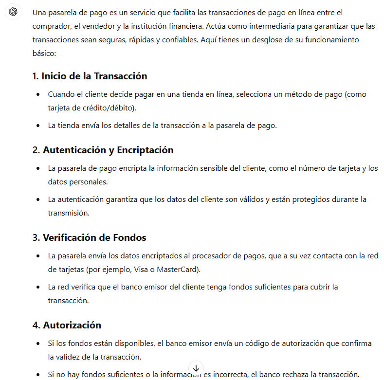
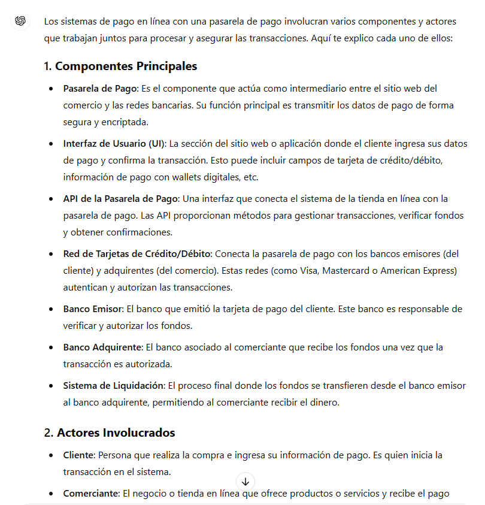
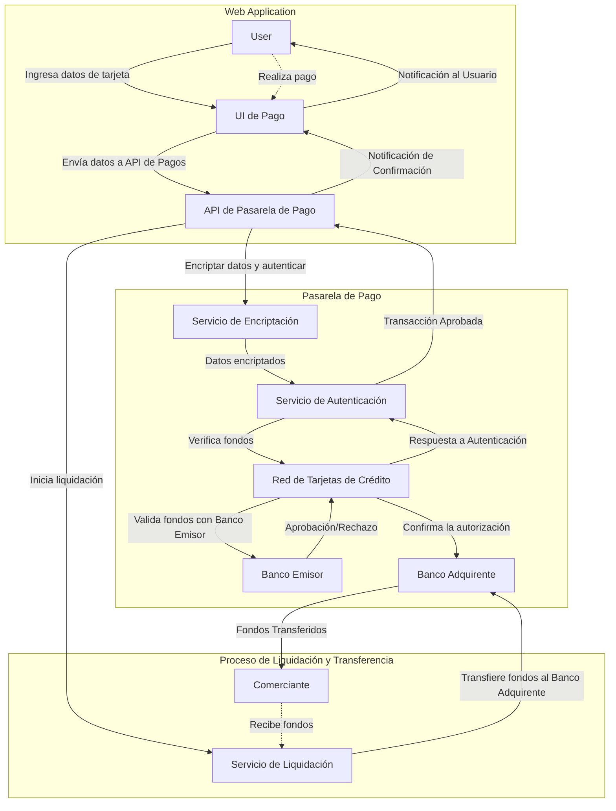
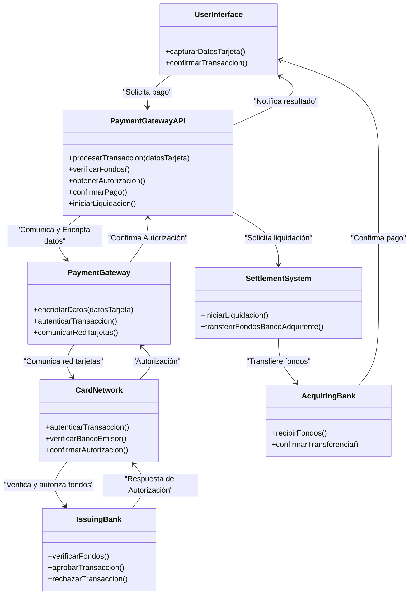
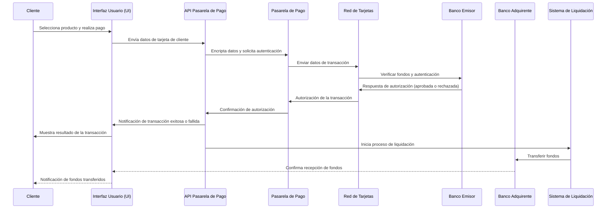
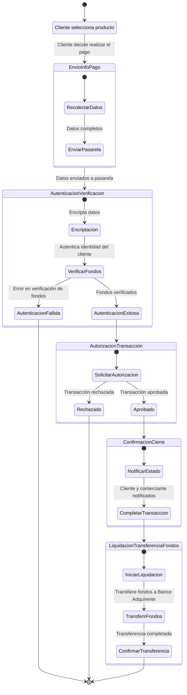

# Documentación del Challenge 04 -  David Angeles

## 1. Investigación Preliminar
**1.1. Comprender el funcionamiento básico de una pasarela de pago.**
    
    - Prompt: Necesito comprender el funcionamiento básico de una pasarela de pago



**1.2. Identificar los principales componentes y actores involucrados en el sistema.**
    
    - Prompt: Necesito identificar los principales componentes y actores involucrados en el sistema.



## 2. Generación de Diagramas con IA
**2.1. Diagrama de Arquitectura de Software en Mermaid**
    
**2.1.1. Prompt:**
        
    ## Descripción del comportamiento a modelar:
    La aplicación es sobre una pasarela de pago para un aplicación web, donde el usuario pueda capturar los datos de su tarjeta y la pasarela se encargue de realizar las operaciones correspondientes sobre la transacción, autenticación, verificación de fondos, autorizaciones, confirmaciones de pago y liquidaciones y transferencias de fondos o todo aquel aspecto que se necesite que no te haya agregado.

    ## Diagrama deseado:
    Diagrama de arquitectura.

    ## Restricciones:
    El sistema debe ser seguro y eficiente

    ## Ejemplo de código:
    Deberá cumplicar con estos aspectos básicos:
    Inicio de la Transacción
    Autenticación y Encriptación
    Verificación de Fondos
    Autorización
    Confirmación de Pago
    Liquidación y Transferencia de Fondos

    ## Salida esperada:
    Utiliza Mermaid para diseñar la arquitectura.


**2.1.2. Diagrama de Arquitectura de Software en Mermaid:**


**2.2. Diagrama de Componentes en UML**

**2.2.1. Prompt:**

    ## Descripción del comportamiento a modelar:
    La aplicación es sobre una pasarela de pago para un aplicación web, donde el usuario pueda capturar los datos de su tarjeta y la pasarela se encargue de realizar las operaciones correspondientes sobre la transacción, autenticación, verificación de fondos, autorizaciones, confirmaciones de pago y liquidaciones y transferencias de fondos o todo aquel aspecto que se necesite que no te haya agregado.

    ## Diagrama deseado:
    Diagrama UML de Componentes.

    ## Restricciones:
    El sistema debe ser seguro y eficiente

    ## Componentes a Diagramar:
    Pasarela de Pago: Es el componente que actúa como intermediario entre el sitio web del comercio y las redes bancarias. Su función principal es transmitir los datos de pago de forma segura y encriptada.

    Interfaz de Usuario (UI): La sección del sitio web o aplicación donde el cliente ingresa sus datos de pago y confirma la transacción. Esto puede incluir campos de tarjeta de crédito/débito, información de pago con wallets digitales, etc.

    API de la Pasarela de Pago: Una interfaz que conecta el sistema de la tienda en línea con la pasarela de pago. Las API proporcionan métodos para gestionar transacciones, verificar fondos y obtener confirmaciones.

    Red de Tarjetas de Crédito/Débito: Conecta la pasarela de pago con los bancos emisores (del cliente) y adquirentes (del comercio). Estas redes (como Visa, Mastercard o American Express) autentican y autorizan las transacciones.

    Banco Emisor: El banco que emitió la tarjeta de pago del cliente. Este banco es responsable de verificar y autorizar los fondos.

    Banco Adquirente: El banco asociado al comerciante que recibe los fondos una vez que la transacción es autorizada.

    Sistema de Liquidación: El proceso final donde los fondos se transfieren desde el banco emisor al banco adquirente, permitiendo al comerciante recibir el dinero.

    ## Salida esperada:
    Utiliza Mermaid para diseñar la arquitectura.

**2.2.2. Diagrama de Componentes en UML en Mermaid:**


**2.3. Diagrama de Secuencia UML**

**2.3.1. Prompt:**
    
    ## Descripción del comportamiento a modelar:
    La aplicación es sobre una pasarela de pago para un aplicación web, donde el usuario pueda capturar los datos de su tarjeta y la pasarela se encargue de realizar las operaciones correspondientes sobre la transacción, autenticación, verificación de fondos, autorizaciones, confirmaciones de pago y liquidaciones y transferencias de fondos o todo aquel aspecto que se necesite que no te haya agregado.

    ## Diagrama deseado:
    Diagrama de Secuencia UML.

    ## Restricciones:
    El sistema debe ser seguro y eficiente, necesito el diagrama de secuencia UML que detalle el flujo de las interacciones del sistema durante una transacción de pago.

    ## Componentes a Diagramar:
    Inicio de Compra: El cliente elige un producto y decide realizar el pago.

    Envío de Información de Pago: La interfaz del comerciante recolecta los datos del cliente y los envía a la pasarela de pago.

    Autenticación y Verificación: La pasarela de pago envía los datos al banco emisor a través de la red de tarjetas para verificar fondos y autenticar la identidad del cliente.

    Autorización de la Transacción: El banco emisor aprueba o rechaza la transacción y notifica a la pasarela.

    Confirmación y Cierre: La pasarela de pago confirma el estado de la transacción al comerciante y al cliente.

    Liquidación y Transferencia de Fondos: Una vez aprobada, la transacción se liquida y los fondos son transferidos al banco adquirente.

    ## Salida esperada:
    Utiliza Mermaid para diseñar la arquitectura.

**2.3.2. Diagrama de Secuencia UML en Mermaid:**


**2.4. Diagrama de Transición de Estados**

**2.4.1. Prompt:**
    ## Descripción del comportamiento a modelar:
    La aplicación es sobre una pasarela de pago para un aplicación web, donde el usuario pueda capturar los datos de su tarjeta y la pasarela se encargue de realizar las operaciones correspondientes sobre la transacción, autenticación, verificación de fondos, autorizaciones, confirmaciones de pago y liquidaciones y transferencias de fondos o todo aquel aspecto que se necesite que no te haya agregado.

    ## Diagrama deseado:
    Diagrama de Transición de Estados.

    ## Restricciones:
    El sistema debe ser seguro y eficiente, necesito el diagrama de transición de estados de las interacciones del sistema durante una transacción de pago.

    ## Componentes a Diagramar:
    Inicio de Compra: El cliente elige un producto y decide realizar el pago.

    Envío de Información de Pago: La interfaz del comerciante recolecta los datos del cliente y los envía a la pasarela de pago.

    Autenticación y Verificación: La pasarela de pago envía los datos al banco emisor a través de la red de tarjetas para verificar fondos y autenticar la identidad del cliente.

    Autorización de la Transacción: El banco emisor aprueba o rechaza la transacción y notifica a la pasarela.

    Confirmación y Cierre: La pasarela de pago confirma el estado de la transacción al comerciante y al cliente.

    Liquidación y Transferencia de Fondos: Una vez aprobada, la transacción se liquida y los fondos son transferidos al banco adquirente.

    ## Salida esperada:
    Utiliza Mermaid para diseñar el diagrama de transición de estados.

**2.4.2. Diagrama de Transición de Estados en Mermaid:**


## 3. Estructura de Carpetas del Proyecto

**3.1. Prompt:**
    
        -Prompt: Dame la estructura de directorios para el desarrollo de la aplicación para la pasarela de pagos, considerando separar los componentes como el front end, backend, servicios de integración y si es posible con un patrón de diseño

**3.2. Estructura de Carpetas:**
```tree
payment-gateway-app/
├── frontend/                   # Frontend de la aplicación
│   ├── public/                 # Archivos estáticos (imágenes, íconos, etc.)
│   ├── src/
│   │   ├── assets/             # Archivos de estilo y recursos de la UI
│   │   ├── components/         # Componentes reutilizables de UI
│   │   ├── pages/              # Páginas de la aplicación (ej. Login, Dashboard)
│   │   ├── services/           # Lógica de comunicación con el backend
│   │   ├── utils/              # Utilidades y helpers
│   │   └── App.js              # Componente raíz
│   └── package.json            # Dependencias y scripts del frontend

├── backend/                    # Backend de la aplicación
│   ├── src/
│   │   ├── controllers/        # Controladores de API que manejan las solicitudes
│   │   ├── services/           # Lógica de negocio y servicios de aplicación
│   │   ├── models/             # Modelos de datos (entidades de la base de datos)
│   │   ├── repositories/       # Acceso a datos y consultas a la base de datos
│   │   ├── routes/             # Rutas de API
│   │   ├── middlewares/        # Middleware para autenticación y validaciones
│   │   ├── config/             # Configuraciones (conexión a base de datos, API keys)
│   │   ├── utils/              # Utilidades y helpers generales
│   │   └── app.js              # Configuración y arranque de la aplicación
│   ├── tests/                  # Pruebas unitarias e integradas
│   └── package.json            # Dependencias y scripts del backend

├── integration-services/       # Servicios de integración externos (ej. bancos, redes de tarjetas)
│   ├── src/
│   │   ├── gateway-apis/       # Conexión con diferentes proveedores de pago
│   │   ├── adapters/           # Adaptadores para cada red de tarjetas o banco
│   │   ├── utils/              # Helpers de encriptación, serialización, etc.
│   │   └── config/             # Configuración de API keys y certificados
│   └── package.json            # Dependencias de los servicios de integración

├── shared/                     # Código compartido entre frontend y backend
│   ├── constants/              # Constantes para toda la aplicación
│   ├── types/                  # Tipos de datos compartidos (ej. interfaces de API)
│   ├── validations/            # Validaciones reutilizables (ej. validaciones de datos de pago)
│   └── helpers/                # Funciones de ayuda comunes (ej. formateo de datos)

├── docs/                       # Documentación de la aplicación
│   ├── architecture/           # Documentación de la arquitectura de la aplicación
│   ├── api/                    # Documentación de la API
│   └── README.md               # Guía para desarrollo y despliegue

├── .env                        # Variables de entorno (claves, configuraciones)
├── .gitignore                  # Archivos y carpetas ignorados por Git
└── README.md                   # Descripción y guía de la aplicación
```

## 4. Conversación con ChatGPT completa
[Enlace](https://chatgpt.com/share/671bf474-67c8-8012-b554-83d943157919)